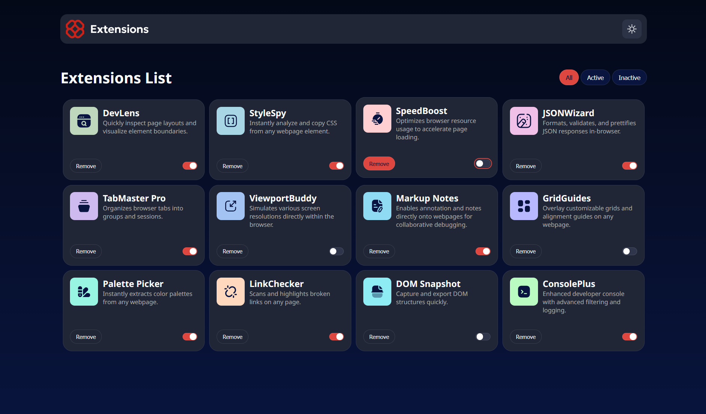

# Frontend Mentor - Browser extensions manager UI solution

This is a solution to the [Browser extensions manager UI challenge on Frontend Mentor](https://www.frontendmentor.io/challenges/browser-extension-manager-ui-yNZnOfsMAp). Frontend Mentor challenges help you improve your coding skills by building realistic projects.

## Table of contents

- [Frontend Mentor - Browser extensions manager UI solution](#frontend-mentor---browser-extensions-manager-ui-solution)
  - [Table of contents](#table-of-contents)
  - [Overview](#overview)
    - [The challenge](#the-challenge)
    - [Screenshot](#screenshot)
    - [Links](#links)
  - [My process](#my-process)
    - [Built with](#built-with)
    - [What I learned](#what-i-learned)
    - [Continued development](#continued-development)

## Overview

### The challenge

Users should be able to:

- Toggle extensions between active and inactive states
- Filter active and inactive extensions
- Remove extensions from the list
- Select their color theme
- See hover and focus states for all interactive elements on the page

### Screenshot



### Links

- Solution URL: [GitHub](https://github.com/Gustavdoiss/Projects-Portifolium/tree/main/Projects/Frontend-Mentor/browser-extensions-manager-ui-main)
- Live Site URL: [GitHub Pages](https://gustavdoiss.github.io/Projects-Portifolium/Projects/Frontend-Mentor/browser-extensions-manager-ui-main/index.html)

## My process

### Built with

- Semantic HTML5 markup
- CSS custom properties
- Flexbox
- CSS Grid
- Vanilla JavaScript
- Fetch API
- Local fonts (variable font)

### What I learned

Aprendi a buscar e renderizar dados dinamicamente a partir de um arquivo JSON usando `fetch()`:

```js
fetch('data.json')
  .then(resposta => resposta.json())
  .then(dados => {
    for (const extObj of dados) {
      const ext = document.createElement('article');
      ext.dataset.active = extObj.isActive;
      // ...
      extensions.append(ext);
    }
  })
```

Aprendi a usar `data-*` para guardar estado nos elementos do DOM e consultá-lo nos filtros:

```js
if (card.dataset.active === "true") {
  card.classList.remove('hidden');
}
```

Aprendi a criar um toggle acessível com `<label>` e `::before`, usando `:has()` para reagir ao estado do checkbox:

```css
label.toggle:has(input:checked) {
  background-color: var(--active-button);
}

label.toggle:has(input:checked)::before {
  left: 15px;
}
```

Aprendi a usar CSS custom properties para implementar troca de tema com uma única classe no `body`:

```css
:root {
  --bg-gradient: linear-gradient(180deg, #040918 0%, #091540 100%);
  --text1: hsl(200, 60%, 99%);
}

.light {
  --bg-gradient: linear-gradient(180deg, #EBF2FC 0%, #EEF8F9 100%);
  --text1: hsl(227, 75%, 14%);
}
```

### Continued development

- Responsividade mobile com media queries
- Animações de entrada dos cards
- Persistência do estado via `localStorage`