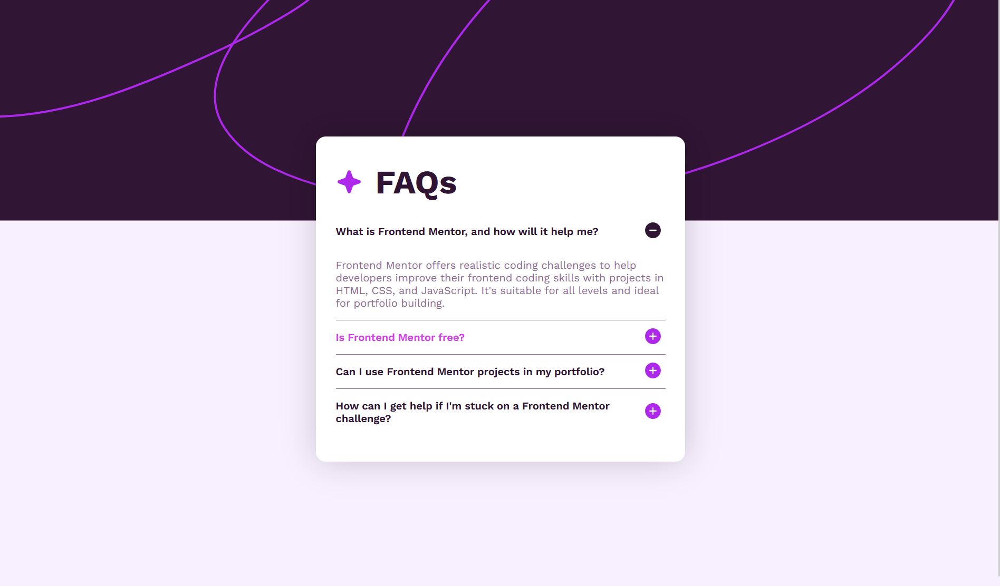

# Frontend Mentor - FAQ accordion solution

This is a solution to the [FAQ accordion challenge on Frontend Mentor](https://www.frontendmentor.io/challenges/faq-accordion-wyfFdeBwBz).

## Table of contents

- [Frontend Mentor - FAQ accordion solution](#frontend-mentor---faq-accordion-solution)
  - [Table of contents](#table-of-contents)
  - [Overview](#overview)
    - [The challenge](#the-challenge)
    - [Screenshot](#screenshot)
  - [My process](#my-process)
    - [Built with](#built-with)
    - [What I learned](#what-i-learned)
    - [Continued development](#continued-development)

## Overview

### The challenge

Users should be able to:

- Hide/Show the answer to a question when the question is clicked
- View the optimal layout for the interface depending on their device's screen size
- See hover states for all interactive elements on the page

### Screenshot



## My process

### Built with

- Semantic HTML5 markup
- CSS Flexbox
- CSS transitions
- Vanilla JavaScript
- Local fonts with `@font-face`

### What I learned

Aprendi a usar `classList.toggle` para alternar classes CSS com JavaScript, evitando a necessidade de variáveis de estado separadas:

```js
answer.classList.toggle('shown');
```

Aprendi também que `transition` não funciona com `display: none/block`, e que a solução é usar `max-height` com overflow hidden:

```css
.answer {
  max-height: 0;
  overflow: hidden;
  transition: max-height 0.25s;
}

.shown {
  max-height: 500px;
}
```

E que caminhos absolutos (como `/pasta/arquivo.svg`) quebram fora do ambiente local — o correto é usar caminhos relativos (`./arquivo.svg`).

### Continued development

- Navegação por teclado (acessibilidade)
- Layout responsivo para mobile
- Uso de atributos ARIA para melhorar a acessibilidade do accordion
